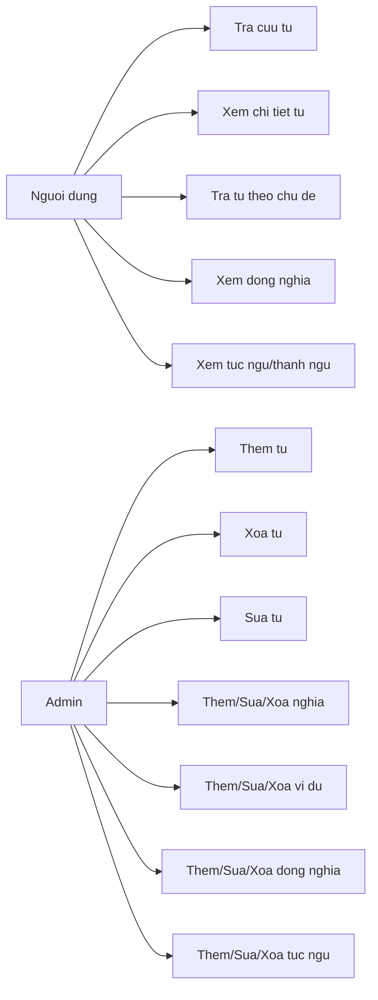

# 19 - So do Use Case

Duoi day la so do Use Case (Mermaid) cho he thong tu dien.

```mermaid
flowchart LR
  User["Nguoi dung"] --> UC1["Tra cuu tu"]
  User --> UC2["Xem chi tiet tu"]
  User --> UC3["Tra tu theo chu de"]
  User --> UC4["Xem dong nghia"]
  User --> UC5["Xem tuc ngu/thanh ngu"]

  Admin["Admin"] --> AC1["Them tu"]
  Admin --> AC2["Xoa tu"]
  Admin --> AC3["Sua tu"]
  Admin --> AC4["Them/Sua/Xoa nghia"]
  Admin --> AC5["Them/Sua/Xoa vi du"]
  Admin --> AC6["Them/Sua/Xoa dong nghia"]
  Admin --> AC7["Them/Sua/Xoa tuc ngu"]
```
