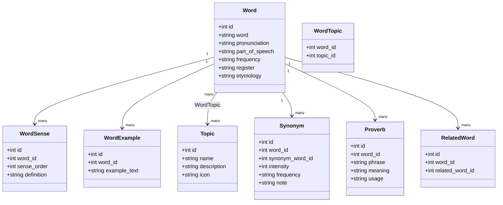

# 20 - So do Class Diagram (mo hinh du lieu)

Duoi day la class diagram (Mermaid) mo ta cac lop du lieu chinh.

```mermaid
classDiagram
  class Word {
    +int id
    +string word
    +string pronunciation
    +string part_of_speech
    +string frequency
    +string register
    +string etymology
  }

  class WordSense {
    +int id
    +int word_id
    +int sense_order
    +string definition
  }

  class WordExample {
    +int id
    +int word_id
    +string example_text
  }

  class Topic {
    +int id
    +string name
    +string description
    +string icon
  }

  class WordTopic {
    +int word_id
    +int topic_id
  }

  class Synonym {
    +int id
    +int word_id
    +int synonym_word_id
    +int intensity
    +string frequency
    +string note
  }

  class Proverb {
    +int id
    +int word_id
    +string phrase
    +string meaning
    +string usage
  }

  class RelatedWord {
    +int id
    +int word_id
    +int related_word_id
  }

  Word "1" --> "many" WordSense
  Word "1" --> "many" WordExample
  Word "many" --> "many" Topic : WordTopic
  Word "1" --> "many" Synonym
  Word "1" --> "many" Proverb
  Word "1" --> "many" RelatedWord
```
