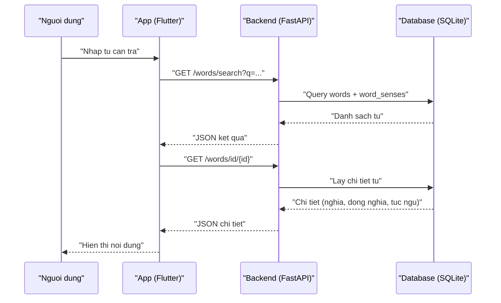

# 21 - So do Sequence (tra cuu tu)

So do Sequence (Mermaid) cho luong tra cuu tu.

```mermaid
sequenceDiagram
  participant U as "Nguoi dung"
  participant A as "App (Flutter)"
  participant B as "Backend (FastAPI)"
  participant D as "Database (SQLite)"

  U->>A: "Nhap tu can tra"
  A->>B: "GET /words/search?q=..."
  B->>D: "Query words + word_senses"
  D-->>B: "Danh sach tu"
  B-->>A: "JSON ket qua"
  A->>B: "GET /words/id/{id}"
  B->>D: "Lay chi tiet tu"
  D-->>B: "Chi tiet (nghia, dong nghia, tuc ngu)"
  B-->>A: "JSON chi tiet"
  A-->>U: "Hien thi noi dung"
```
